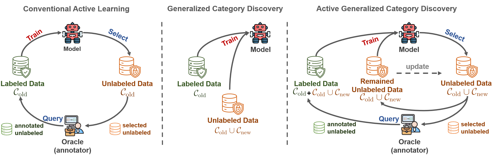

# Active Generalized Category Discovery

PyTorch implementation of our paper: **[Active Generalized Category Discovery (CVPR 2024)](https://arxiv.org/abs/2403.04272)**



## New Setting :star2:

To address the inherent issues of [Generalized Category Discovery (**GCD**)](https://www.robots.ox.ac.uk/~vgg/research/gcd/), including imbalanced classification performance and inconsistent confidence between old and new classes, we take the spirit of Active Learning (**AL**) and propose a new setting called Active Generalized Category Discovery (**AGCD**). The goal is to improve the performance of GCD by actively selecting a limited amount of valuable samples for labeling from the oracle. To solve this problem, we devise an adaptive sampling strategy, which jointly considers *novelty*, *informativeness* and *diversity* to adaptively select novel samples with proper uncertainty. However, owing to the varied orderings of label indices caused by the clustering of novel classes, the queried labels are not directly applicable to subsequent training. To overcome this issue, we further propose a stable label mapping algorithm that transforms ground truth labels to the label space of the classifier, thereby ensuring consistent training across different active selection stages.

**Distinguishing between AL and AGCD.** (1) AGCD could be viewed as an open-world extrapolated version of AL requiring models to classify both old and new classes, and the unlabeled data could contain new classes. (2) In conventional AL, models are not trained on $\mathcal{D}_u$, which is only used for sample selection and only the selected samples engage in training. In contrast, in AGCD, models not only select samples in $\mathcal{D}_u$​ but are also trained on it.

**Distinguishing between Open-Set AL and AGCD.** Open-set AL merely cares about the accuracy of old classes, and treats new classes as noise/outliers, it aims to detect/filter them and mainly query samples from old classes. Instead, AGCD further clusters new classes.


In this repo, we set up the whole pipeline and workflow of AGCD with several data selection strategies. In AGCD, we perform:

* Base model training.
* Multi-round active learning:
  * Data selection with specific strategies.
  * Label mapping.
  * AGCD training.

By default, we use the training method [SimGCD](https://arxiv.org/abs/2211.11727) for model training. For other GCD training methods, please refer to their official implementations.


## Running :running:

### Dependencies

```
loguru
numpy
pandas
scikit_learn
scipy
torch==1.10.0
torchvision==0.11.1
tqdm
```

### Datasets

We conduct experiments on 7 dataset:

* Generic datasets: CIFAR-10, CIFAR-100, ImageNet-100
* Fine-grained datasets: [CUB](https://drive.google.com/drive/folders/1kFzIqZL_pEBVR7Ca_8IKibfWoeZc3GT1), [Stanford Cars](https://ai.stanford.edu/~jkrause/cars/car_dataset.html), [FGVC-Aircraft](https://www.robots.ox.ac.uk/~vgg/data/fgvc-aircraft/), [Herbarium19](https://www.kaggle.com/c/herbarium-2019-fgvc6)

### Config

Set paths to datasets in `config.py` and `utils_al/handler.py`

### Training the base model

```shell
CUDA_VISIBLE_DEVICES=0 python train_base.py --dataset_name 'cub' --prop_train_labels 0.5 --num_old_classes -1 --batch_size 128 --grad_from_block 11 --epochs 100 --num_workers 4 --use_ssb_splits --sup_weight 0.35 --weight_decay 5e-5 --transform 'imagenet' --lr 0.1 --eval_funcs 'v2' --warmup_teacher_temp 0.07 --teacher_temp 0.04 --warmup_teacher_temp_epochs 30 --memax_weight 2 --exp_name cub_simgcd_base
```

### Multi-rounds Active Learning for GCD

```shell
CUDA_VISIBLE_DEVICES=0 python train_al_ema.py --dataset_name 'cub' --num_workers 4 --use_ssb_splits --prop_train_labels 0.2 --num_old_classes -1 --base_ckpts_date 20231014-012416 --eval_funcs 'v2' --warmup_teacher_temp 0.04 --teacher_temp 0.04 --warmup_teacher_temp_epochs 1 --memax_weight 2 --strategy NovelMarginSamplingAdaptive --num_round 5 --num_query 100 --epochs 15 --al_batch_size 8 --lr 0.1 --al_weight 1 --al_supcon_weight 1 --al_cls_weight 1 --logits_temp 0.1 --ema_decay 0.9 --adaptive_round 2 --exp_id exp1
```

:warning: when `--strategy` is `NovelMarginSamplingAdaptive`, please specify the argument `--adaptive_round`.


## Citing this work :clipboard:

```
@inproceedings{ma2024active,
  title={Active generalized category discovery},
  author={Ma, Shijie and Zhu, Fei and Zhong, Zhun and Zhang, Xu-Yao and Liu, Cheng-Lin},
  booktitle={Proceedings of the IEEE/CVF Conference on Computer Vision and Pattern Recognition},
  pages={16890--16900},
  year={2024}
}
```


## Acknowledgements :gift:

In building the AGCD codebase, we reference the following two repositories: [SimGCD](https://github.com/CVMI-Lab/SimGCD) and [DeepAL](https://github.com/ej0cl6/deep-active-learning/tree/master)


## License :white_check_mark:

This project is licensed under the MIT License - see the [LICENSE](https://github.com/mashijie1028/ActiveGCD/blob/main/LICENSE) file for details.


## Contact :email:

If you have further questions or discussions, feel free to contact me:

Shijie Ma (mashijie2021@ia.ac.cn)
